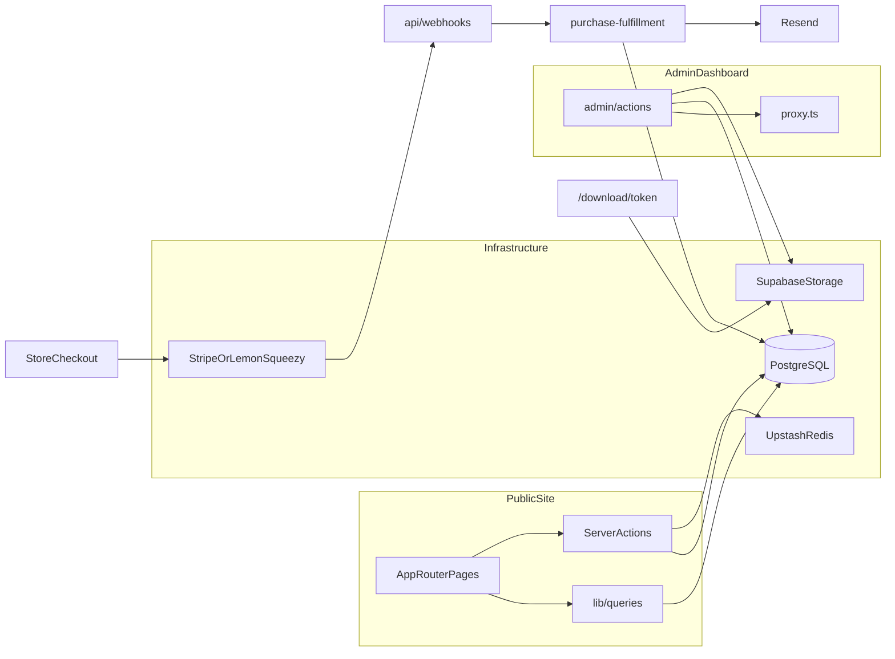

# AGENTS.md

Guidance for AI coding agents working in the Devix repository. Primary branch: `main`. This file is authoritative over the stale root `README.md`.

For architecture, data flows, trade-offs, and technical debt, see [`DESIGN.md`](DESIGN.md).

## Project Summary

Devix is a premium software-agency platform: marketing site, portfolio, project estimator, digital product store, and admin CMS/dashboard. Single Next.js app (not a monorepo), managed with Bun, deployed on Vercel (region `sin1`).

## Stack & Tooling

- **Framework:** Next.js 16 App Router, React 19, TypeScript 6, React Compiler, typed routes/env
- **Database:** Prisma 7 + `@prisma/adapter-pg` → Supabase PostgreSQL (pooler for runtime, direct for migrations)
- **Storage:** Supabase Storage (product files, media library)
- **Cache / rate limits:** Upstash Redis (optional in dev — graceful fallback when unset)
- **Email:** Resend
- **Payments:** Stripe and Lemon Squeezy behind a provider abstraction
- **Auth:** Custom admin sessions (bcrypt + JWE cookies) — **not** Supabase Auth or NextAuth
- **Testing:** Vitest (unit), Playwright (e2e visual baselines — not in CI)
- **Lint/format:** ESLint flat config, Prettier with Tailwind plugin

Use **Bun** for all scripts (`bun dev`, `bun test`, etc.). Do not assume npm/pnpm.

| Command | Purpose |
|---------|---------|
| `bun dev` | Prisma generate + Next dev server |
| `bun build` / `bun start` | Production build and serve |
| `bun lint` / `bun type-check` / `bun test` | CI-equivalent checks |
| `bun db:seed` | Seed CMS, portfolio, sample products |

## Repository Layout

```
src/
├── app/              # Routes: (public)/, admin/(dashboard)/, api/webhooks/
├── actions/          # Server actions (public + admin/)
├── lib/              # Business logic, payment, queries, schemas, redis
├── components/       # atoms/, molecules/, organisms/, admin/
├── proxy.ts          # Request proxy (rate limits + admin auth gate)
├── hooks/, types/, utils/, content/
prisma/               # schema.prisma, migrations/, seed.ts
e2e/                  # Playwright tests
```

**Layering:** `app/` pages → `actions/` (mutations) or `lib/queries/` (reads) → `lib/` → Prisma / Supabase / Redis / payment SDKs.

## Local Setup & Required Env

1. Copy [`.env.example`](.env.example) → `.env.local`
2. Fill Supabase Postgres URLs (`DATABASE_URL` pooler port 6543, `DIRECT_URL` direct port 5432)
3. Run migrations: `bunx prisma migrate deploy` (uses `DIRECT_URL` via [`prisma.config.ts`](prisma.config.ts))

**Build fails without:** `DATABASE_URL`, `JWT_SECRET`, `NEXT_PUBLIC_SUPABASE_URL`, `NEXT_PUBLIC_SUPABASE_ANON_KEY` (enforced in [`next.config.ts`](next.config.ts)).

See [`.env.example`](.env.example) for Stripe, Lemon Squeezy, Resend, Turnstile, Redis, and payment provider vars. Do not duplicate the full list here.

## Architecture Overview



Three domains to respect:

1. **Public site** — cached Prisma reads, form actions (contact, estimator, checkout)
2. **Admin CMS** — authenticated server actions, Supabase uploads, cache invalidation
3. **Store** — checkout starts payment; **webhooks only** create `Purchase` rows and download tokens

## Request Proxy, Auth & Security

**Proxy:** [`src/proxy.ts`](src/proxy.ts) is the Next.js 16 request proxy (not `middleware.ts`). It applies global and `/api/` rate limits and gates `/admin/*` routes via session cookies.

**Admin auth (custom):**

- Users in Prisma `User` model; passwords hashed with bcrypt
- Sessions: JWE-encrypted HTTP-only cookies via `jose` ([`src/lib/auth.ts`](src/lib/auth.ts), [`src/lib/session-token.ts`](src/lib/session-token.ts))
- Cookie names: `__Host-devix_session` (HTTPS prod), `devix_session` (dev)
- Defense in depth: proxy → dashboard layout `verifyAdminSession()` → per-action auth + `verifyCsrfOrigin()`
- Flat admin model: max 4 users, `isActive` flag; public `/admin/register` is disabled (invite-only)

**Other security:** Production CSP and security headers in `next.config.ts`; Cloudflare Turnstile on checkout (optional); Bearer token on [`src/pages/api/health.ts`](src/pages/api/health.ts).

Do not introduce Supabase Auth, NextAuth, or RBAC unless explicitly requested.

## Supabase Usage (Postgres + Storage Only)

- **Queries:** Prisma → Postgres (no Supabase JS for DB access)
- **No RLS** — authorization is application-layer only
- **Browser client:** [`src/lib/supabase-browser.ts`](src/lib/supabase-browser.ts) — admin media uploads
- **Service client:** [`src/lib/supabase-admin.ts`](src/lib/supabase-admin.ts) — signed download URLs, product bucket `products`
- [`src/lib/supabase-server.ts`](src/lib/supabase-server.ts) exists but is unused — do not wire new code through it without reason

Requires `SUPABASE_SERVICE_ROLE_KEY` for downloads and admin storage operations (see `.env.example`).

## Money & Pricing (Decimal)

All persisted money uses Prisma **`Decimal`**, not `Float` or `Int`. Helpers: [`src/lib/money.ts`](src/lib/money.ts).

| Field | Semantics |
|-------|-----------|
| `Product.price` | Major units (`Decimal(19,4)`) — admin input / display |
| `Product.priceMinor` | Smallest currency unit (`Decimal(19,0)`) — canonical charge amount |
| `Purchase.amountMinor` | Paid snapshot at fulfillment |
| `EstimatorLead.budgetUsd` / `deliverableSavingsUsd` | USD quote amounts (`Decimal(19,2)`) |

**Rules for agents:**

- Use `resolveProductAmount()` before checkout; prefer `priceMinor` when set
- Use `formatMinor()` / `formatUsdDecimal()` for display — not raw `.toFixed()` on floats
- Convert to Stripe/Lemon `number` only at SDK boundary via `minorToStripeUnit()` / `stripeUnitToMinor()`
- Import `Decimal` from `@/lib/money` (re-exported from Prisma runtime)
- Do not pass raw `Decimal` to client components — serialize to string in props

See [DESIGN.md §7](DESIGN.md#7-money--pricing-model) for full model and migration notes.

## Payments (Dual Provider Abstraction)

- Interface: [`src/lib/payment/types.ts`](src/lib/payment/types.ts) — `PaymentProvider`
- Factory: [`src/lib/payment/index.ts`](src/lib/payment/index.ts) — `getPaymentProvider()`
- Active provider resolution ([`src/lib/payment/config.ts`](src/lib/payment/config.ts)): Admin `SiteSettings.paymentProvider` → `PAYMENT_PROVIDER` env → `"stripe"`
- Stripe: embedded checkout on `/store/checkout`; Lemon Squeezy: overlay checkout, requires `Product.lemonSqueezyVariantId`

**Critical:** Fulfillment is **webhook-only**. Checkout actions in [`src/actions/purchase.ts`](src/actions/purchase.ts) never create `Purchase` records.

- Webhooks: [`src/app/api/webhooks/stripe/route.ts`](src/app/api/webhooks/stripe/route.ts), [`src/app/api/webhooks/lemonsqueezy/route.ts`](src/app/api/webhooks/lemonsqueezy/route.ts)
- Idempotency: `ProcessedPaymentEvent` table
- Fulfillment: [`src/lib/purchase-fulfillment.ts`](src/lib/purchase-fulfillment.ts)
- Revocation (refunds/disputes): [`src/lib/purchase-revocation.ts`](src/lib/purchase-revocation.ts)

When editing Stripe webhooks, follow the existing inline pattern in that route (it partially bypasses the provider abstraction). Lemon webhooks use the abstraction consistently.

## Digital Store & Download Tokens

**Models:** `Product`, `Purchase` in [`prisma/schema.prisma`](prisma/schema.prisma).

**Checkout flow:** User pays → provider webhook → fulfillment creates `Purchase` with `downloadToken` → confirmation email links to `/download/{token}`.

**Download limits (not strictly one-time):**

- Default **max 3 downloads** within a **24-hour** window from fulfillment
- `tokenUsed` set when `downloadCount >= maxDownloads`
- `revokedAt` blocks access (refunds, disputes, admin revoke)
- `deliveredFileKey` snapshots the product file at purchase time
- Each download request gets a signed Supabase URL (300s TTL) via [`src/lib/download-token.ts`](src/lib/download-token.ts)

Status pages: `/download/used`, `/expired`, `/revoked`, `/invalid`, `/error`. Admin can rotate tokens or resend email via [`src/actions/admin/purchases.ts`](src/actions/admin/purchases.ts).

## Data Layer (Prisma)

- `relationMode = "prisma"` — Supabase-friendly; no DB-level FK enforcement
- Client singleton: [`src/lib/prisma.ts`](src/lib/prisma.ts) with `pg` Pool adapter
- Migrations in `prisma/migrations/`; seed with `bun db:seed`

**Model groups:** CMS (`SiteSection`, `FaqItem`, `ServiceItem`, `TeamMember`, `SiteSettings`), portfolio (`Project`), CRM (`ContactSubmission`, `EstimatorLead`, `ConsultationFeedback`), commerce (`Product`, `Purchase`, `ProcessedPaymentEvent`), audit (`ActivityLog`, `MediaAsset`).

## Caching & Rate Limiting

[`src/lib/redis.ts`](src/lib/redis.ts): `cachedQuery()` for read-through cache, `invalidateCache()` on admin writes. Returns `null` when Upstash env is missing — code must not assume Redis is available.

Rate limiters in [`src/lib/rate-limit.ts`](src/lib/rate-limit.ts) cover auth, contact, purchase, download, API, etc. When adding admin mutations that change cached content, follow existing actions and call `invalidateCache()` with the same keys.

## Server Actions vs API Routes

**Default to server actions** (`"use server"` in [`src/actions/`](src/actions/)) for all UI mutations.

**API routes only for:**

- Payment webhooks (raw body + signature verification)
- Admin CSV export ([`src/app/api/admin/leads/export/route.ts`](src/app/api/admin/leads/export/route.ts))
- Legacy health check ([`src/pages/api/health.ts`](src/pages/api/health.ts) — Pages Router)

**Page data:** use [`src/lib/queries/`](src/lib/queries/), not server actions.

**Error patterns:**

- Public actions: return `{ success/ok, error? }` — do not throw
- Admin actions: often `throw new Error(...)` after Zod/auth failures
- Validation: Zod schemas in [`src/lib/schemas.ts`](src/lib/schemas.ts); use `safeParse` + first issue message

Server action body limit: 50mb (large admin media uploads).

## Code Conventions

- Imports: `@/` alias only; keep imports at top of file (no inline imports)
- Semicolons, double quotes, 2-space indent (Prettier)
- Components: PascalCase (`StoreProductCard.tsx`); lib modules: kebab-case (`purchase-fulfillment.ts`)
- Tests: sibling `test/` folders, `*.test.ts`; mock at module boundaries (`@/lib/prisma`, not `@prisma/client`)
- See [`src/lib/test/mocks/README.md`](src/lib/test/mocks/README.md) for mock kit conventions
- `no-console` enforced in production builds
- Use exhaustive `never` checks in switch defaults over discriminated unions
- Minimize scope; match surrounding code style

## Domain Features (Pointers)

- **Project estimator:** [`src/lib/estimator-*.ts`](src/lib/estimator-steps.ts), leads via [`src/actions/estimator-leads.ts`](src/actions/estimator-leads.ts)
- **CMS:** JSON blobs in `SiteSection` plus relational FAQ/services/team tables
- **Maintenance mode:** `SiteSettings.maintenanceMode` + [`MaintenanceGate`](src/components/MaintenanceGate.tsx)
- **Media library:** Supabase Storage + `MediaAsset` metadata in Prisma

## Testing & CI

- **Unit:** Vitest; run `bun test`. Colocated tests with shared mock registry in `src/lib/test/mocks/`
- **E2E:** Playwright in `e2e/` — not run in main CI workflow
- **CI** ([`.github/workflows/ci.yaml`](.github/workflows/ci.yaml) on `main` and `dev`): lint → type-check → test → build

**Before claiming work is done:** run `bun lint`, `bun type-check`, and `bun test`.

## Gotchas & Anti-Patterns

- Do **not** use Supabase Auth or add `middleware.ts` — use [`src/proxy.ts`](src/proxy.ts)
- Do **not** fulfill purchases outside webhook handlers
- Do **not** assume Redis or Upstash is always configured
- Do **not** add RBAC without explicit request (flat admin today)
- Do **not** trust root `README.md` — it is stale create-next-app boilerplate
- CSP changes require updating allowlists in [`next.config.ts`](next.config.ts) (Stripe, Turnstile, Vercel Insights)
- Guest checkout only — no customer accounts; buyers identified by email on `Purchase`
- Legacy Pages Router health endpoint — do not migrate without request

## Read More (When Working in These Areas)

| Area | Source of truth |
|------|-----------------|
| Architecture & trade-offs | [`DESIGN.md`](DESIGN.md) |
| Environment variables | [`.env.example`](.env.example) |
| Database schema | [`prisma/schema.prisma`](prisma/schema.prisma) |
| Money helpers | [`src/lib/money.ts`](src/lib/money.ts) |
| Unit test mocks | [`src/lib/test/mocks/README.md`](src/lib/test/mocks/README.md) |
| Payment providers | [`src/lib/payment/`](src/lib/payment/) |
| Purchase fulfillment | [`src/lib/purchase-fulfillment.ts`](src/lib/purchase-fulfillment.ts) |
