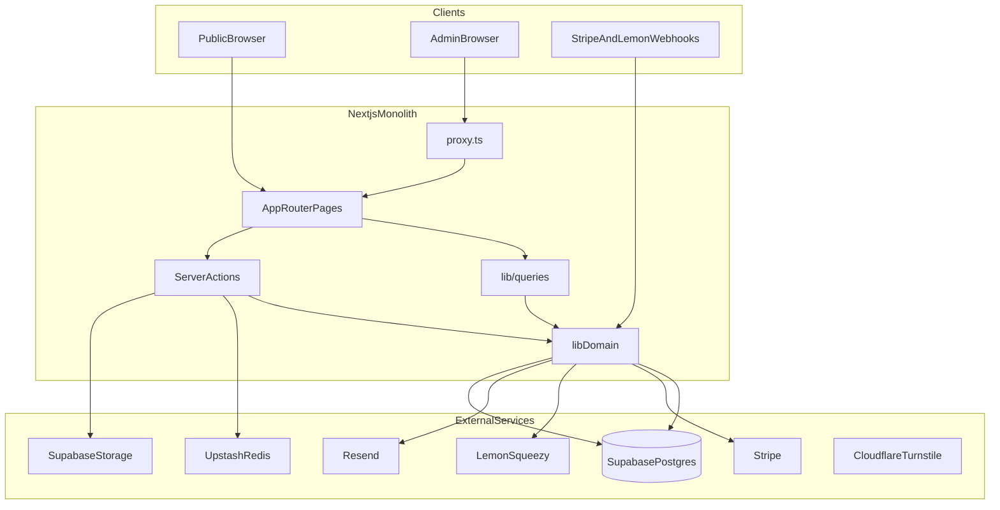
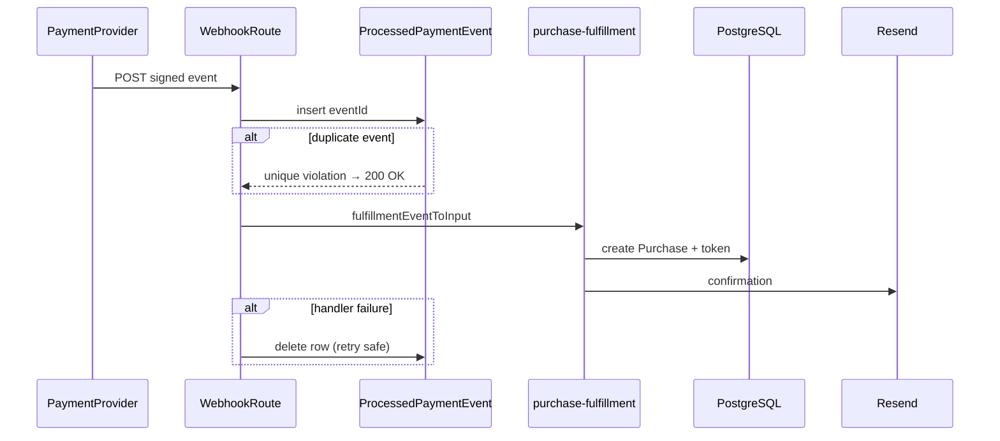

# DESIGN.md

Architecture reference for Devix — how systems fit together, intentional trade-offs, and known debt. For operational guidance (commands, conventions, gotchas), see [`AGENTS.md`](AGENTS.md).

**Audience:** Engineers and architects onboarding to Devix or making cross-cutting changes.

**Documentation map:** Operational commands and conventions live in [`AGENTS.md`](AGENTS.md). Environment variables in [`.env.example`](.env.example). Schema in [`prisma/schema.prisma`](prisma/schema.prisma).

### Resolved design choices

These were clarified before this document was written; the text reflects **implemented** behavior, not aspirational targets.

| Topic | Decision |
|-------|----------|
| **Money type** | Prisma `Decimal` for all persisted amounts (migrated from `Float`/`Int`). Integer semantics for minor units; SDK boundary converts to `number`. |
| **CSP** | Production static allowlist with `'unsafe-inline'` / `'unsafe-eval'` — **not** hash- or nonce-based CSP. SHA-256 appears elsewhere (webhook HMAC, checkout idempotency keys, session crypto), not in CSP headers. |
| **Download tokens** | **Implemented:** max 3 downloads within 24 hours — not strictly one-time cryptographic use. |
| **Dual payment providers** | Stripe unavailable as MoR in Indonesia; Lemon Squeezy acts as MoR for international sales — documented as business driver. |
| **Markets / currency** | USD is the default catalog and charge currency; multi-currency minor units supported (including zero-decimal IDR, JPY). Estimator can display converted prices client-side. |
| **Product surfaces** | Two surfaces in one app: B2B agency lead gen (estimator, CRM) and B2C digital store (guest checkout). |
| **`supabase-server.ts`** | Unused; kept for now — candidate for deletion (see §20). |
| **Root README** | Stale boilerplate; use AGENTS.md + DESIGN.md instead. |

---

## 1. System Context & Product Goals

Devix is a single-product web application with two complementary surfaces:

1. **Agency marketing** — portfolio, CMS-driven content, and a project estimator that captures B2B leads for custom software work (international SMB/startup audience).
2. **Digital store** — B2C guest checkout for downloadable products sold to international SMB/startup clients (templates, assets, etc.) with webhook fulfillment and time-limited download tokens.

There is no multi-tenant SaaS layer, no customer accounts, and no Supabase Auth. Admin access is invite-only (max four flat admins). Primary branch: `main`.

---

## 2. High-Level Architecture

One **modular monolith**: Next.js 16 App Router on Vercel (`sin1`), Bun toolchain, all domain logic in `src/`. No separate API service; Prisma is the only database access path (not Supabase JS for Postgres).

---

## 3. Deployment & Runtime Topology

| Concern | Implementation |
|---------|----------------|
| Hosting | Vercel Fluid Compute (Node.js default) |
| Build | Bun install/build via [`vercel.json`](vercel.json) |
| Runtime DB | `DATABASE_URL` — Supabase pooler (port 6543) |
| Migrations | `DIRECT_URL` — direct Postgres (port 5432) via [`prisma.config.ts`](prisma.config.ts) |
| Cache / limits | Upstash Redis — optional; code degrades when unset |
| Required build env | `DATABASE_URL`, `JWT_SECRET`, `NEXT_PUBLIC_SUPABASE_*` enforced in [`next.config.ts`](next.config.ts) |

Two Postgres URLs exist because Prisma migrations need a direct connection while serverless runtime uses the pooler.

---

## 4. Application Layering & Module Boundaries

| Layer | Location | Responsibility |
|-------|----------|----------------|
| Routes | `src/app/` | Public `(public)/`, admin `admin/(dashboard)/`, webhooks `api/webhooks/` |
| Mutations | `src/actions/` | `"use server"` — forms, checkout, admin CRUD |
| Reads | `src/lib/queries/` | Cached Prisma reads for pages |
| Domain | `src/lib/` | Payments, fulfillment, money, auth, redis, schemas |
| UI | `src/components/` | atoms → molecules → organisms → admin |

**When to use what:**

| Pattern | Use when |
|---------|----------|
| Server action | UI-triggered mutation with Zod validation |
| App Router API route | Raw body webhooks, CSV export, non-HTML responses |
| Pages API | Legacy health check only ([`src/pages/api/health.ts`](src/pages/api/health.ts)) |

---

## 5. Request Edge: `proxy.ts` Pattern

[`src/proxy.ts`](src/proxy.ts) is the Next.js 16 request proxy (not `middleware.ts`). Pipeline order:

1. `/api/*` rate limit (tier 4)
2. Global rate limit for all other paths (tier 1)
3. Admin gate: JWE cookie presence + signature validity on `/admin/*`

**Matcher:** Excludes `_next/static`, `_next/image`, and `favicon.ico` ([`config.matcher`](src/proxy.ts)).

**Intentional limits:** The proxy validates JWE structure and expiry only — it does **not** hit the database for `isActive`. Full admin verification (DB + CSRF) runs in layout and server actions.

---

## 6. Data Architecture (Prisma + PostgreSQL)

- **ORM:** Prisma 7 with `@prisma/adapter-pg` ([`src/lib/prisma.ts`](src/lib/prisma.ts))
- **`relationMode = "prisma"`** — no DB-level foreign keys; referential integrity is application responsibility (Supabase/serverless friendly)
- **IDs:** UUID for `User`; cuid for public-facing records

**Model groups:**

| Group | Models |
|-------|--------|
| CMS | `SiteSection`, `FaqItem`, `ServiceItem`, `TeamMember`, `SiteSettings` |
| Portfolio | `Project`, `ProjectTechStack`, `ProjectDeveloper` |
| CRM | `ContactSubmission`, `EstimatorLead`, `ConsultationFeedback` |
| Commerce | `Product`, `Purchase`, `ProcessedPaymentEvent` |
| Audit | `ActivityLog`, `MediaAsset` |

Schema source of truth: [`prisma/schema.prisma`](prisma/schema.prisma).

---

## 7. Money & Pricing Model

**Canonical type:** Prisma `Decimal` for all persisted money. Application helpers live in [`src/lib/money.ts`](src/lib/money.ts).

| Field | Model | DB type | Semantics |
|-------|-------|---------|-----------|
| `price` | Product | `Decimal(19,4)` | Major-unit list price (admin input, display fallback) |
| `priceMinor` | Product | `Decimal(19,0)?` | Charge amount in smallest currency unit |
| `amountMinor` | Purchase | `Decimal(19,0)?` | Paid amount snapshot at fulfillment |
| `budgetUsd` | EstimatorLead | `Decimal(19,2)` | USD estimate anchor |
| `deliverableSavingsUsd` | EstimatorLead | `Decimal(19,2)?` | USD deduction from estimate |

**Charge path:** `resolveProductAmount()` prefers `priceMinor`; if null, derives from `price` via `decimalFromMajorPrice()`. Zero-decimal currencies (JPY, IDR, etc.) skip the ×100 step.

**SDK boundary:** Stripe and Lemon Squeezy APIs require JavaScript `number` integers. Convert at the edge only:

- App → Stripe: `minorToStripeUnit(amountMinor)` 
- Stripe/Lemon → App: `stripeUnitToMinor(webhookTotal)`

**Payment types:** `CreateCheckoutParams.amountMinor` and fulfillment events use `MoneyMinor` (`Decimal`), not raw `number`.

**Display:** Use `formatMinor()` for store/checkout (via `resolveProductAmount()`); `formatUsdDecimal()` for estimator admin views. Do not pass raw `Decimal` to client components — serialize to string in props if needed.

**Markets:** Default product currency is `usd`. Stripe minimums and zero-decimal handling cover IDR, JPY, and other supported codes in [`src/lib/money.ts`](src/lib/money.ts). Estimator UI may show converted display prices; persisted lead budgets are USD `Decimal`.

**Estimator calculators** ([`src/types/estimator.ts`](src/types/estimator.ts)) still use internal `number` math; values are wrapped in `Decimal` at persistence ([`src/actions/estimator-leads.ts`](src/actions/estimator-leads.ts)).

**Future (Option B):** Drop redundant `Product.price` once all rows have authoritative `priceMinor` and admin UX reads minor units only.

Migration: [`prisma/migrations/20260610120000_money_fields_to_decimal/`](prisma/migrations/20260610120000_money_fields_to_decimal/).

---

## 8. Authentication & Authorization

**Not Supabase Auth.** Custom admin sessions:

- Passwords: bcrypt
- Sessions: JWE-encrypted HTTP-only cookies via `jose` (8h TTL)
- Cookie names: `__Host-devix_session` (HTTPS prod), `devix_session` (dev)

**Defense in depth:**

1. `proxy.ts` — cookie + JWE validity
2. Admin layout — `verifyAdminSession()` (DB `isActive`, Redis-cached whitelist, 600s TTL)
3. Server actions — auth + `verifyCsrfOrigin()` on mutations

Flat admin model: no RBAC. Public `/admin/register` disabled (invite-only).

**Trade-off:** No server-side session revocation until token expiry; deactivated admins remain effective until cache TTL + JWE expiry.

---

## 9. Security Architecture

| Control | Implementation |
|---------|----------------|
| **CSP** | Static allowlist in [`next.config.ts`](next.config.ts), production only. Uses `'unsafe-inline'` and `'unsafe-eval'` for Stripe, Turnstile, and Vercel widgets — **not** hash- or nonce-based CSP. |
| **CSRF** | Origin header check on admin mutations; skipped when `Origin` absent |
| **Bot protection** | Optional Cloudflare Turnstile on checkout/resend |
| **Rate limiting** | Tiered Upstash limiters in proxy + action-level |
| **Input/output** | Zod validation; DOMPurify on CMS HTML; `escapeHtml` in emails; CSV formula guards |

XSS containment relies heavily on sanitization, not strict CSP.

---

## 10. Payment Architecture (Dual Provider)

**Business context:** Stripe is unavailable as Merchant of Record in Indonesia; Lemon Squeezy acts as MoR for international sales where configured. Both providers coexist behind a factory.

| Piece | Location |
|-------|----------|
| Interface | [`src/lib/payment/types.ts`](src/lib/payment/types.ts) — `PaymentProvider` |
| Factory | [`src/lib/payment/index.ts`](src/lib/payment/index.ts) — `getPaymentProvider()` |
| Resolution | Admin `SiteSettings.paymentProvider` → `PAYMENT_PROVIDER` env → `"stripe"` |

**Checkout modes:**

- **Stripe:** Embedded checkout on `/store/checkout`
- **Lemon Squeezy:** Overlay via `lemon.js`; requires `Product.lemonSqueezyVariantId`

**Critical invariant:** Fulfillment is **webhook-only**. Checkout actions never create `Purchase` rows.

**Provider asymmetry:** Stripe webhook route ([`src/app/api/webhooks/stripe/route.ts`](src/app/api/webhooks/stripe/route.ts)) is partially imperative (async payment, disputes). Lemon webhooks use the abstraction consistently.

**Lemon pricing:** Checkout price comes from the Lemon **variant ID**, not DB `priceMinor`. Catalog and charged amount can diverge — see debt register.

---

## 11. Webhook Processing, Idempotency & Revocation

- **Idempotency:** `ProcessedPaymentEvent` deduplicates; synthetic IDs for Lemon
- **Fulfillment:** [`src/lib/purchase-fulfillment.ts`](src/lib/purchase-fulfillment.ts)
- **Revocation:** [`src/lib/purchase-revocation.ts`](src/lib/purchase-revocation.ts) — refunds/disputes set `revokedAt`
- **Disputes:** Stripe auto-evidence ([`src/lib/dispute-evidence.ts`](src/lib/dispute-evidence.ts)); digital-goods policy keeps access revoked after dispute closed

---

## 12. Digital Delivery & Download System

- Opaque CSPRNG tokens at fulfillment
- `deliveredFileKey` snapshots product file at purchase time
- Supabase `products` bucket; signed URLs (300s TTL) per download request
- **Limits:** Default **max 3 downloads within 24 hours** (not strictly one-time)
- `tokenUsed` when `downloadCount >= maxDownloads`
- Atomic `updateMany` concurrency guard; IP rate limits on download route
- Admin rotate/revoke via [`src/actions/admin/purchases.ts`](src/actions/admin/purchases.ts)

Status pages: `/download/used`, `/expired`, `/revoked`, `/invalid`, `/error`.

---

## 13. CMS & Content Model

Hybrid storage:

- **Relational lists:** `FaqItem`, `ServiceItem`, `TeamMember` — ordered CRUD
- **JSON blobs:** `SiteSection` keyed by section enum — marketing copy blocks
- **Singleton:** `SiteSettings` — payment provider, maintenance mode, footer links
- **Defaults:** [`src/lib/content-defaults.ts`](src/lib/content-defaults.ts) when DB empty
- **Validation:** Zod schemas per section key; whole-section replace on admin save

New section keys require schema/code updates; FAQ rows are simple CRUD.

---

## 14. Project Estimator & Lead Funnel

- Client-orchestrated wizard; pricing in pure TS ([`src/types/estimator.ts`](src/types/estimator.ts))
- Deliverable customizer with dependency-aware exclusions ([`src/lib/estimator-deliverables.ts`](src/lib/estimator-deliverables.ts))
- `sessionStorage` session (24h TTL)
- Server lead upsert on conversion ([`src/actions/estimator-leads.ts`](src/actions/estimator-leads.ts)); fingerprint dedup
- Contact form links via `estimatorLeadId` → `CONVERTED` status

**Boundary:** Client provides instant pricing UX; server validates and persists at conversion. Budget stored as `Decimal` USD + human-readable `budgetDisplay`.

---

## 15. Caching & Performance Strategy

| Layer | Mechanism | TTL / scope |
|-------|-----------|-------------|
| Request | React `cache()` | Per request dedup |
| Cross-request | Redis read-through ([`cachedQuery`](src/lib/redis.ts)) | 3600s content TTL |
| Invalidation | `revalidatePath` + `invalidateCache()` on admin writes | Explicit key maps |

Optional Redis: no stampede protection by design. React Compiler enabled; bundle analyzer and Lighthouse CI on PRs ([`.github/workflows/perf.yml`](.github/workflows/perf.yml)).

---

## 16. Supabase Role in the Stack

| Capability | Access path |
|------------|-------------|
| Postgres | Prisma only — no Supabase JS DB client |
| Storage | Supabase JS — browser anon (admin media), service role (products bucket, signed downloads) |
| Auth | **Not used** |
| RLS | **Not used** — authorization in application layer |

Buckets: `products` (private) vs public media buckets. [`src/lib/supabase-server.ts`](src/lib/supabase-server.ts) exists but is unused — do not wire new code through it without reason.

Requires `SUPABASE_SERVICE_ROLE_KEY` for downloads and admin storage (see [`.env.example`](.env.example)).

---

## 17. Email & Notifications

Resend for transactional mail ([`src/lib/email.ts`](src/lib/email.ts)):

- Purchase confirmation with download link
- Admin notifications (contact, leads)

**Coupling:** Email failure fails the fulfillment webhook handler — provider retries reprocess after idempotency rollback.

---

## 18. Observability & Operations

- Vercel Speed Insights
- Bearer-authenticated health endpoint — DB + Redis ping ([`src/pages/api/health.ts`](src/pages/api/health.ts))
- `ActivityLog` audit trail
- Maintenance mode via `SiteSettings.maintenanceMode` + [`MaintenanceGate`](src/components/MaintenanceGate.tsx)

---

## 19. Testing Architecture (Design Level)

| Suite | Scope | CI |
|-------|-------|-----|
| Vitest unit | ~53 files, colocated `test/` folders, shared mock registry | Yes ([`.github/workflows/ci.yaml`](.github/workflows/ci.yaml)) |
| Playwright e2e | Visual baselines in `e2e/` | No (manual) |

Architectural invariants (webhook idempotency, money helpers, fulfillment mapping) are enforced in unit tests. UI regressions rely on manual e2e runs.

---

## 20. Technical Debt & Evolution Notes

### Key technical decisions

| Decision | What the code shows | Rationale |
|----------|---------------------|-----------|
| **Decimal money, not Float/Int** | Five money fields use `@db.Decimal`; helpers in `money.ts` | Exact persistence; integer minor semantics; Stripe/Lemon still need `number` at SDK edge |
| **Webhook-only fulfillment** | Checkout creates sessions only; `Purchase` rows from webhooks | Provider is payment source of truth; prevents client-side forgery |
| **Dual payment providers** | `getPaymentProvider()` + admin `SiteSettings` toggle | Stripe embedded UX where available; Lemon as MoR for Indonesia/international |
| **Lemon pricing from variant ID** | `createCheckout` uses `lemonSqueezyVariantId`; no `amountMinor` to Lemon | MoR owns price/tax in Lemon dashboard |
| **Stripe webhook partial abstraction** | Inline stripe route for async payment, disputes | Incremental edge cases; Lemon uses abstraction consistently |
| **ProcessedPaymentEvent insert-first** | Row inserted before handler; deleted on failure | Safe retries under at-least-once webhook delivery |
| **JWE sessions** | `EncryptJWT` in `session-token.ts` | Stateless on Vercel; no session store |
| **`proxy.ts` not `middleware.ts`** | Next.js 16 request proxy export | Platform convention for this app |
| **`relationMode = prisma`** | No DB-level FK enforcement | Supabase pooler / serverless compatibility |
| **Optional Redis** | `getRedisClient()` returns null when unset | Local dev and CI without Upstash |
| **Hybrid CMS** | Relational lists + `SiteSection` JSON | Fast marketing copy edits; structured admin tables |
| **Client-side estimator pricing** | TS constants; server validates on lead save | Instant UX; server authority at conversion |
| **Multi-download tokens (3/24h)** | `maxDownloads` default 3, `tokenExpiresAt` +24h | Grace for failed downloads; not one-time crypto tokens |
| **Static CSP with unsafe-inline** | `next.config.ts` production headers | Third-party checkout widgets without nonce middleware |
| **Signed URL delivery (300s)** | `download-token.ts` | Offload bandwidth to Supabase; short-lived per click |
| **Dispute → permanent revoke** | `purchase-revocation.ts` + dispute handlers | Digital goods chargeback policy |
| **Guest checkout by email** | No `Customer` model | B2C simplicity |

### Known gaps

| Area | Gap | Risk |
|------|-----|------|
| **Dual Product price fields** | `price` + `priceMinor` both maintained (Option A) | Drift if admin updates one path only |
| **Lemon price sync** | Charged amount from Lemon variant, not DB `priceMinor` | Catalog vs checkout mismatch |
| **Lemon checkout idempotency** | `lemonCheckoutIdempotencyKey()` unused in provider | Duplicate checkout sessions |
| **Success page asymmetry** | Stripe session enrichment + email resend; Lemon generic success | Poor Lemon buyer UX |
| **Stripe webhook abstraction** | Inline route vs shared `PaymentProvider` mappers | Maintenance burden |
| **Admin price validation** | Always Stripe minimum even when Lemon active | May reject valid Lemon-only products |
| **CSP strength** | `unsafe-inline` / `unsafe-eval` in production | XSS relies on sanitization |
| **CSP dev/prod parity** | No CSP in development | Regressions found late |
| **CSRF on public actions** | No origin check on contact/purchase | Turnstile + rate limits only |
| **Session revocation** | 8h JWE, no server-side kill | Deactivated admin lag |
| **Unused modules** | `supabase-server.ts` (candidate for deletion), stricter `sanitizeHtml()` unused in prod | Contributor confusion |
| **Legacy Pages API** | Health check on Pages Router | Dual routing paradigm |
| **Playwright not in CI** | Visual baselines manual | UI regressions undetected |
| **No RLS** | All authorization in app layer | Misconfigured Supabase client risk |
| **Documentation** | Stale root `README.md` | Use AGENTS.md + DESIGN.md instead |

**Suggested directions (document only):**

- Unify Stripe webhook through `PaymentProvider` or document permanent split
- Lemon parity: success page, email resend, checkout idempotency
- Consolidate on `priceMinor` only (Option B — drop redundant `Product.price`)
- CSP hardening (nonces or `'sha256-…'` script hashes) if third-party widgets allow — **not** current production CSP

---

## Documentation Map

| Document | Purpose |
|----------|---------|
| [`AGENTS.md`](AGENTS.md) | Agent/operator guide — commands, conventions, gotchas |
| [`DESIGN.md`](DESIGN.md) | Architecture — this file |
| [`.env.example`](.env.example) | Environment variable reference |
| [`prisma/schema.prisma`](prisma/schema.prisma) | Database schema |
